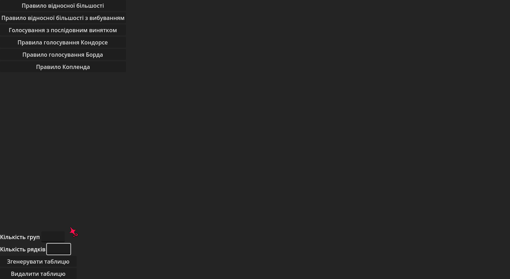

<h2 align="center">Програмний застосунок для реалізації методів та правил голосування</h2>
<h3>Розроблений застосунок дозволяє використовувати наступні методи голосування:</h3>

- Правило відносної більшості
- Правило відносної більшості з вибуванням
- Послідовне виключення
- Правило Кондорсе
- Правило Борда
- Правило Копленда

<h3>Демонстрація роботи з програмою:</h3>

